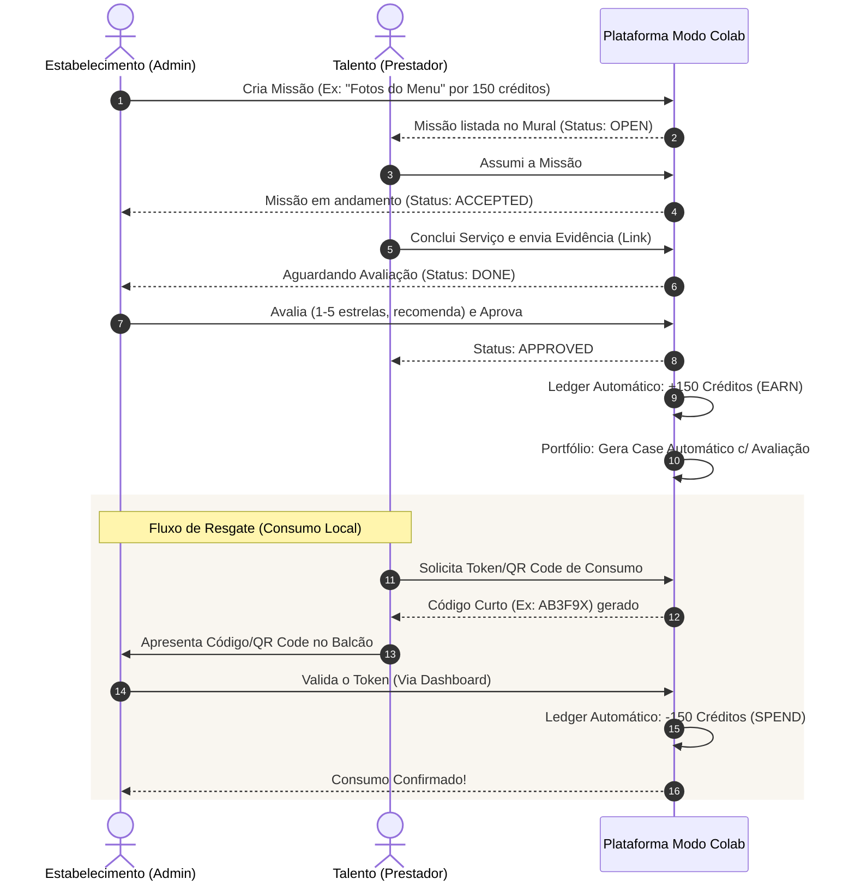
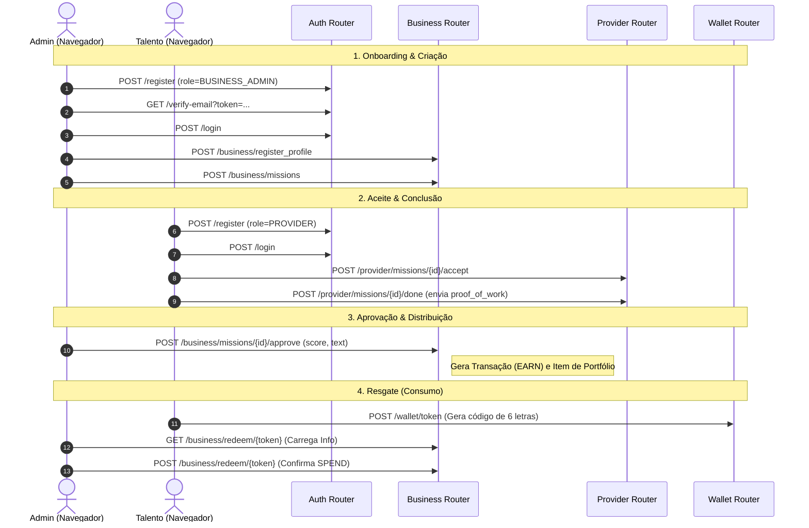

# Modo Colab 🚀

**Modo Colab** é uma plataforma de "banco de escambo moderno" que conecta estabelecimentos locais (cafeterias, restaurantes, padarias, estúdios) a pessoas em busca de experiências reais para fortalecer seus portfólios (designers, fotógrafos, social media, devs).

A premissa é simples: em vez de dinheiro, a moeda de troca é a experiência e o produto.\
- **O Estabelecimento** recebe serviços digitais de alta qualidade (fotos do menu, artes para Instagram, gestão de tráfego) pagando com o custo marginal de seus produtos e o uso de seu espaço.\
- **O Talento Local (Prestador)** recebe uma oportunidade de trabalhar com clientes reais, ganha um case para o portfólio oficial, e ainda consome no estabelecimento através de um sistema de "créditos" e "tokens".

---

## 🔄 Como Funciona (Fluxo Principal)



---

## 🚀 Funcionalidades Principais

### Autenticação & Segurança
- **Cadastro de Usuários:** Perfis separados para `BUSINESS_ADMIN` (Estabelecimentos) e `PROVIDER` (Talentos Locais).
- **Verificação de E-mail:** Ao se cadastrar, o usuário recebe um e-mail com link verificado por token assinado (válido por 24h). Conta só é ativada após confirmação.
- **Reenvio de Verificação:** Usuários que não receberam o e-mail podem solicitar novo envio.
- **Esqueceu a Senha / Redefinição:** Fluxo completo de "Forgot Password" com token seguro (válido por 2h), e-mail HTML estilizado e redefinição via formulário.
- **Sessões Seguras:** Gerenciamento de sessão via middleware (Starlette `SessionMiddleware`), proteção por role-based access (`BUSINESS_ADMIN` vs `PROVIDER`).
- **Hashing de Senha:** bcrypt via Passlib.

### Onboarding de Estabelecimentos
- **Cadastro de Perfil:** Os estabelecimentos informam nome, categoria (Café, Restaurante, Padaria, etc.), site e Instagram.
- **Status de Verificação:** O perfil passa por um status `is_verified` até ser aprovado, garantindo um ambiente seguro.
- **Vínculo Usuário-Negócio:** O admin é vinculado ao estabelecimento via `business_id` ao registrar o perfil.

### Mural de Missões (Core Loop)
- **Criar Missão:** O estabelecimento publica demandas reais com título, descrição e valor em créditos.
- **Aceitar Missão:** Prestadores visualizam missões abertas (`OPEN`) e escolhem aceitar.
- **Marcar Concluída:** O prestador marca como `DONE` quando finaliza o serviço (com campo opcional de prova de entrega).
- **Avaliar & Aprovar:** O admin do negócio avalia (nota 1–5 + texto de recomendação), define se permite uso no portfólio público, e aprova (`APPROVED`).
- **Ciclo Completo:** Ao aprovar, o sistema automaticamente: atualiza o status, cria a avaliação (`Rating`), credita os créditos (`Transaction EARN`) e gera o item de portfólio com opção de ocultar o nome do parceiro por privacidade.

### Carteira & Sistema de Créditos (Ledger)
- **Saldo:** Calculado como `SUM(EARN) - SUM(SPEND)` a partir do histórico de transações.
- **Extrato:** Visualização completa das transações do prestador.
- **Geração de Token (QR Code):** O prestador gera um token seguro com validade de 5 minutos, convertido em QR Code para apresentar no balcão.

### Resgate de Créditos (Redeem)
- **Link de Resgate:** Cada QR Code gera um link `/redeem/{token}` com detalhes do token.
- **Confirmação pelo Caixa:** O admin do negócio (logado) visualiza o token e confirma o consumo, gerando uma transação `SPEND`.

### Portfólio Público
- **Geração Automática:** Itens de portfólio são criados automaticamente ao aprovar uma missão.
- **Visibilidade Controlada:** O prestador pode alternar entre público e privado para cada item.
- **Página Pública:** URL pública `/u/{id}/portfolio` acessível sem login, exibindo projetos e nota média.

---

## 🛣️ Fluxo de Endpoints (E2E)

Abaixo está a representação técnica do ciclo completo (End-to-End) mapeando os endpoints da API:



---

## 🛠 Tech Stack

| Camada | Tecnologia |
|---|---|
| **Backend** | Python + FastAPI |
| **Banco de Dados** | PostgreSQL + SQLAlchemy ORM |
| **Frontend / UI** | HTMX + Jinja2 Templates + Vanilla CSS |
| **Migrations** | Alembic |
| **E-mails** | fastapi-mail (Mailtrap / SMTP) |
| **QR Code** | qrcode + Pillow |

---

## 💻 Como Rodar o Projeto Localmente

Nós criamos um script facilitador (`run_local.sh`) que cuida de praticamente tudo para você (gerencia o banco pelo Docker, cria o ambiente virtual, instala dependências e roda as migrações).

### Pré-requisitos
- **Docker e Docker Compose** instalados e rodando.
- **Python 3.9+** instalado no sistema.

### Passo a Passo

1. **Clone o repositório e acesse a pasta:**
   ```bash
   git clone https://github.com/ilaraca/coffee-colab.git
   cd coffee-colab
   ```

2. **Configure as variáveis de ambiente:**
   ```bash
   cp .env.example .env
   ```

3. **Inicie o servidor localmente:**
   Pela primeira vez, use a flag `--setup`:
   ```bash
   ./run_local.sh --setup
   ```
   
4. **Acesse a Plataforma:**
   Abra seu navegador em: **[http://localhost:8000](http://localhost:8000)**

---

## 🧪 Testes Automatizados

O projeto inclui uma suíte de testes automatizados com **pytest**:

```bash
./verify.sh
```

---

## 🔑 Credenciais de Teste (Seed)

| Perfil | Email de Login | Senha |
|---|---|---|
| **Negócio (Admin Verificado)** | `admin@modocolab.local` | `Admin123!` |
| **Talento Local (Prestador)** | `provider@modocolab.local` | `Provider123!` |

---

## 📧 Configuração de E-mail

| Variável | Descrição | Valor padrão |
|---|---|---|
| `MAIL_FROM` | Remetente | `noreply@modocolab.com` |

---
